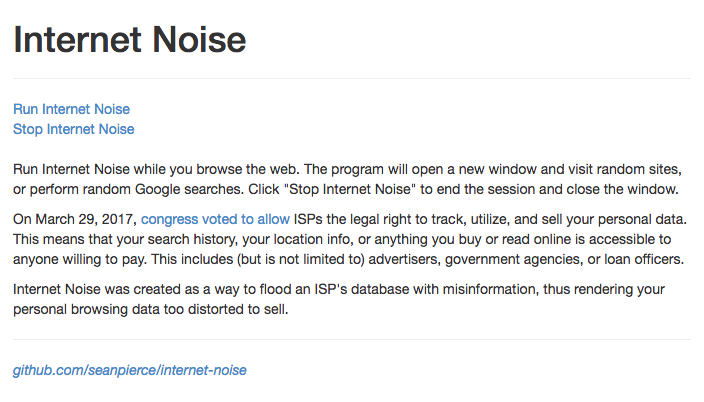

# Internet Noise

#### Internet Noise is a javascript program that floods an ISP's database with nonsense by visiting random websites and performing random Google searches.

This project was inspired by Dan Schultz's [Internet Noise generator](https://github.com/slifty/internet_noise/blob/master/index.html). I recreated the site from scratch using easier-to-understand javascript as an educational exercise. As he mentions on his version, running this _"will make some noise as a form of digital protest. IT DOES NOT MAKE YOU SAFE."_

For a more secure browsing experience you could:
* Use [Tor Browser](https://www.torproject.org/projects/torbrowser.html.en)
* Use a [VPN](https://en.wikipedia.org/wiki/Virtual_private_network)
* Overthrow the oligarchy.

How To Use:
* Visit https://seanpierce.github.io/internet-noise
* click "Run Internet Noise"

The app will open a new window and perform a new search, or visit a new page every 6-8 seconds in the background while you browse.

_screen shot_  
<kbd></kbd>

License MIT
2017, Sean Pierce  

_Sean Pierce is a programming student in Portland, OR._
